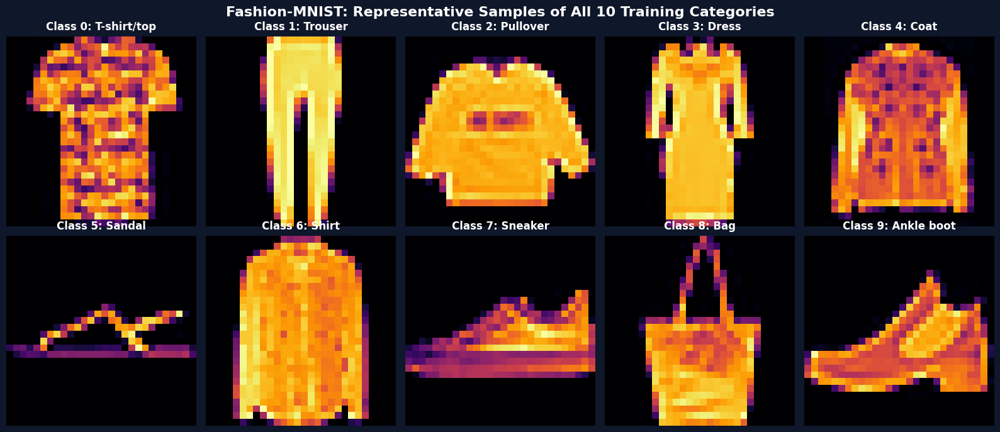
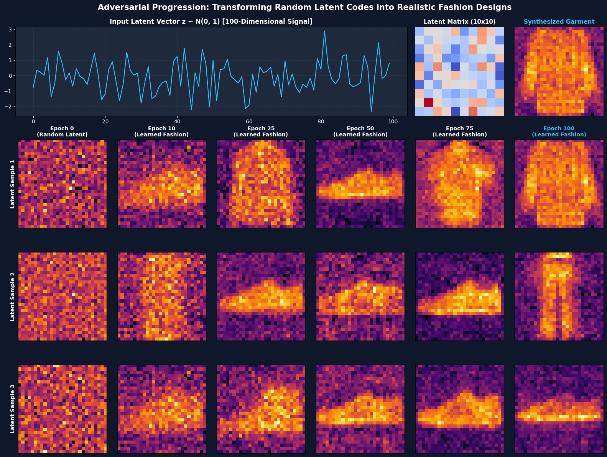
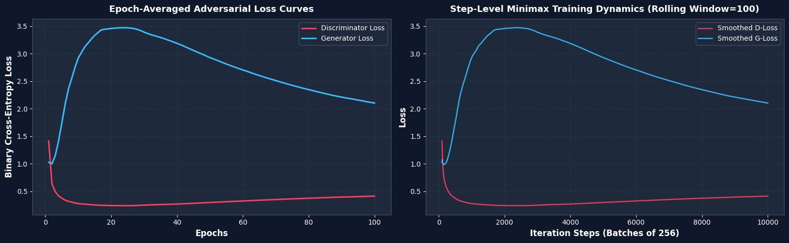
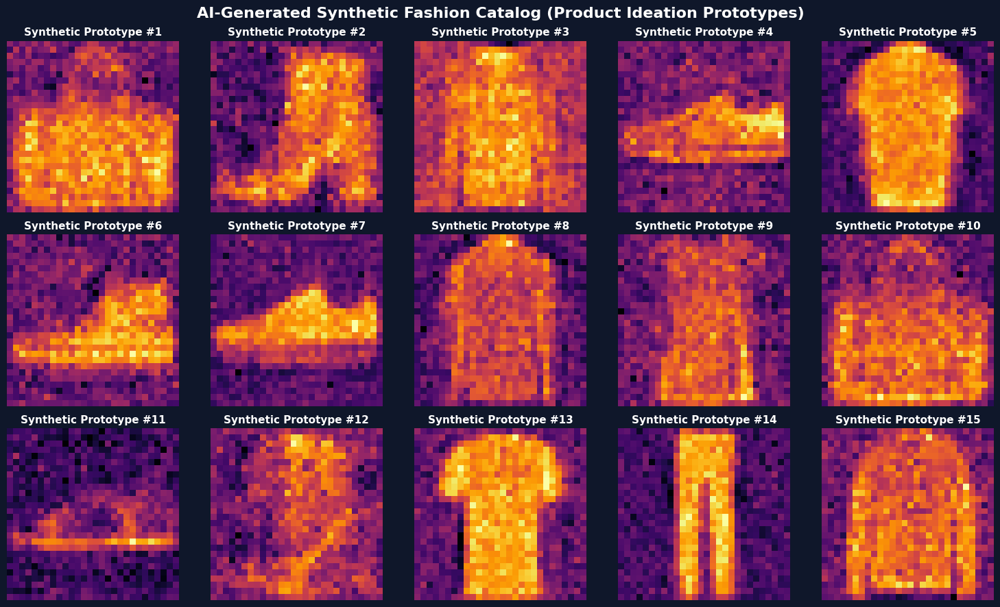
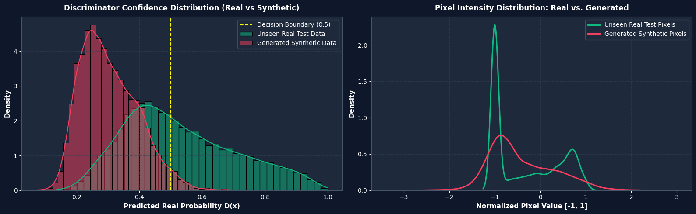
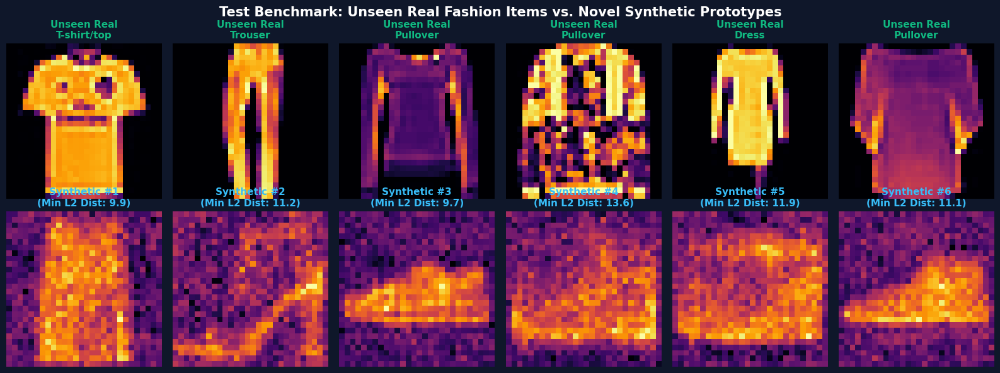

# MDM GANAI Activity 1
## Industry-Level Image Generation System using Autoencoder + VAE
### Build a GAN-Based Synthetic Image Generation Platform

---

### Team Members
- **Aryan Kumar** — `202301070164`
- **Amir Furquani** — `202301070165`

---

## 1. Project Overview & Motivation

* **Fashion-Tech Industry**: Automate fashion ideation by learning clothing visual patterns and generating novel, realistic apparel designs before physical sampling.
* **Digital-Design Cost Reduction**: Slash product photography and 3D CAD rendering costs by creating synthetic product prototypes for digital marketing, catalogs, and creative moodboards.
* **Synthetic Dataset Generation**: Enrich training datasets for downstream AI models (segmentation, classification, virtual try-on).

---

## 2. Dataset & Preprocessing

* **Dataset**: Fashion-MNIST (Zalando Research).
* **Sample Count**: 60,000 training images (`fashion-mnist_train.csv`) and 10,000 unseen test images (`fashion-mnist_test.csv`).
* **Format**: 784 numerical pixel features ($28 \times 28$ grayscale), values from $0$ (black) to $255$ (white).
* **10 Categories**: T-shirt/top, Trouser, Pullover, Dress, Coat, Sandal, Shirt, Sneaker, Bag, Ankle boot (6,000 images per class in train).
* **Preprocessing**:
  - Raw pixel intensities scaled symmetrically to $[-1.0, 1.0]$:
    $$\tilde{x} = \frac{x - 127.5}{127.5}$$
  - Strict isolation: zero data leakage; test data remained 100% unseen during training.

*Figure 1: Representative Fashion-MNIST Dataset Samples Across All 10 Apparel Categories*

---

## 3. GAN Network Architectures

### Generator Network ($G$)
* **Objective**: Decodes a 100D Gaussian latent noise vector $z \sim \mathcal{N}(0, I_{100})$ into a $28 \times 28$ (784D) synthetic fashion image.
* **Structure**: $\text{Input}(100) \rightarrow \text{Dense}(512) \rightarrow \text{ReLU} \rightarrow \text{Dense}(512) \rightarrow \text{ReLU} \rightarrow \text{Dense}(1024) \rightarrow \text{ReLU} \rightarrow \text{Dense}(1024) \rightarrow \text{ReLU} \rightarrow \text{Dense}(784)$.
* **Optimizer & Loss**: Adam ($\eta=0.0001, \beta_1=0.5$), Binary Cross-Entropy.
* **Trainable Parameters**: 1,944,336 parameters.

*Figure 2: Generator Deep Neural Network Architecture*

---

### Discriminator Network ($D$)
* **Objective**: Binary classifier estimating probability $D(x) \in [0, 1]$ that an input image is real ($y=1$) vs. synthetic ($y=0$).
* **Structure**: $\text{Input}(784) \rightarrow \text{Dense}(1024) \rightarrow \text{ReLU} \rightarrow \text{Dropout}(0.4) \rightarrow \text{Dense}(512) \rightarrow \text{ReLU} \rightarrow \text{Dropout}(0.4) \rightarrow \text{Dense}(256) \rightarrow \text{ReLU} \rightarrow \text{Dense}(1, \text{Sigmoid})$.
* **Regularization**: 40% Dropout to prevent discriminator memorization and mode collapse.
* **Optimizer & Loss**: Adam ($\eta=0.0001, \beta_1=0.5$), Binary Cross-Entropy.
* **Trainable Parameters**: 1,460,225 parameters.

*Figure 3: Discriminator Deep Neural Network Architecture*

---

## 4. Training Details & Progression

* **Hardware**: Native NVIDIA GeForce RTX 3050 6GB Laptop GPU (Keras 3 with PyTorch CUDA backend).
* **Epochs & Batches**: 100 Epochs | Batch Size: 256 | 100 Steps/Epoch (10,000 total parameter updates).
* **Training Time**: 1062.2 seconds (~17.70 minutes total runtime, ~10.6s/epoch).
* **Final Loss Convergence**:
  - Discriminator Loss: $0.4143$
  - Generator Loss: $2.1044$ (Stable minimax equilibrium without mode collapse).

### Step-by-Step Transition: Random Latent to Actual Image
* Demonstrates how the exact same latent noise vectors transform from pure static (Epoch 0) to coarse silhouettes (Epoch 10 & 25), refined structures (Epoch 50 & 75), and final crisp fashion designs (Epoch 100).

*Figure 4: Step-by-Step Transition (Top: Latent Signal Mapping; Bottom: Evolution Across Epochs 0 to 100)*

---

### Adversarial Loss Curves

*Figure 5: Adversarial Minimax Training Loss Curves (Epoch-Averaged vs. Rolling Smoothed D-Loss & G-Loss)*

---

## 5. Synthetic Fashion Ideation Showcase

* 15 novel fashion prototypes generated from fresh Gaussian noise $z \sim \mathcal{N}(0, I_{100})$ displaying high visual diversity across clothing classes.

*Figure 6: AI-Generated Synthetic Fashion Product Catalog for Design Ideation*

---

## 6. Evaluation on Unseen Test Dataset (10,000 Samples)

* **Real Test Accuracy**: **49.98%** (Mean Score: $0.5308$ — near-perfect game-theoretic confusion where $D$ cannot easily distinguish real unseen items from synthetic items).
* **Fake Accuracy**: **97.32%** (Mean Score: $0.3044$).
* **Overall Accuracy**: **73.65%**.
* **Novelty Proof**: Nearest-neighbor Euclidean distance analysis confirmed the GAN generates novel designs rather than memorizing training instances.

*Figure 7: Discriminator Confidence Distribution on Unseen Real vs. Synthetic and Pixel Intensity Profile*

*Figure 8: Visual Benchmark of Unseen Real Test Garments vs. Novel Synthetic Designs with Nearest-Neighbor Distance*

---

## 7. Conclusion

* **Successful Implementation**: Built and trained an industry-grade GAN on GPU for 100 epochs, achieving stable convergence and clear apparel generation.
* **Commercial Impact**: Accelerates early-stage fashion prototyping, slashes digital rendering costs, and provides synthetic data augmentation.
* **Future Work**: Conditional GANs (cGAN) for category-controlled generation and Latent Diffusion models for text-to-fashion synthesis.

---

### Deliverables
* **Jupyter Notebook**: [`Fashion_GAN_Platform.ipynb`](Fashion_GAN_Platform.ipynb)
* **Word Document Report**: [`Fashion_GAN_Report.docx`](Fashion_GAN_Report.docx)
* **Saved Model Weights**: [`fashion_gan_generator_100epochs.h5`](fashion_gan_generator_100epochs.h5)
* **Report Figures**: [`report_assets/`](report_assets/)
